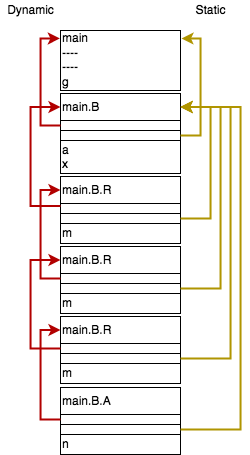

# Problem 1

## a)

```text
9423
```

## b)



## c)

The program is static scoping, so when searching variables, 1) it will search `local variable g` first. However, there isn't one, so 2)it will try following the static link to `precedure B`. In scope of B, there is still no variable g, so 3) we continue following the static link to `main`, which we find g here.

# Problem 2

## a)

| Production     | Semantic Rule                                 |
| -------------- | --------------------------------------------- |
| `B -> O B1 B2` | `B.val = '(' + B1.val + O.val + B2.val + ')'` |
| `B -> not B1`  | `B.val = '(' + 'not' + B1.val + ')'`          |
| `B -> id`      | `B.val = id.val`                              |
| `O -> and`     | `O.val = 'and'`                               |
| `O -> or`      | `O.val = 'or'`                                |

## b)

Productions -> List of Semantic Rules

- `B -> id`
  - `B.pri = 4`
  - `B.val = id.val`
- `B -> not B1`
  - `B.pri = 3`
  - ```
    if B1.pri < B.pri:
        B.val = 'not' + '(' + B1.val + ')'
    else:
        B.val = B1.val
    ```
- `B -> O B1 B2`

  - `B.pri = O.pri`
  - ```
    if B2.pri <= B.pri:
        if B1.pri >= B.pri:
            B.val = B1.val + O.val + '(' + B2.val + ')'
        else:
            B.val = '(' + B1.val + ')' + O.val + '(' + B2.val + ')'
    else:
        if B1.pri < B.pri:
            B.val = '(' + B1.val + ')' + O.val + B2.val
        else:
            B.val = B1.val + O.val + B2.val
    ```

- `O -> and`
  - `O.val = 'and'`
  - `O.pri = 2`
- `O -> or`
  - `O.val = 'or'`
  - `O.pri = 1`
